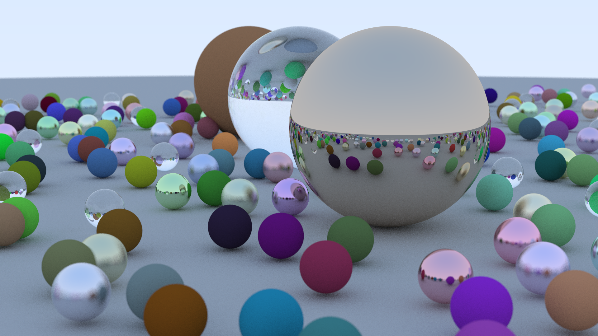

# raytracing
Implementation of CPU raytracer following along with the Ray Tracing In One Weekend series by Peter Shirley. This is an active work in progress. 

Currently status: completed the first book, yet to start the second. 

Some snapshots of progress so far:

### Metals and Lambertian Spheres

### Glass materials, and moveable camera with depth of field

### Example image from end of Book 1

### Moving Objects & Motion Blur 

### Making Animations

Without motion blur:

With motion blur:

